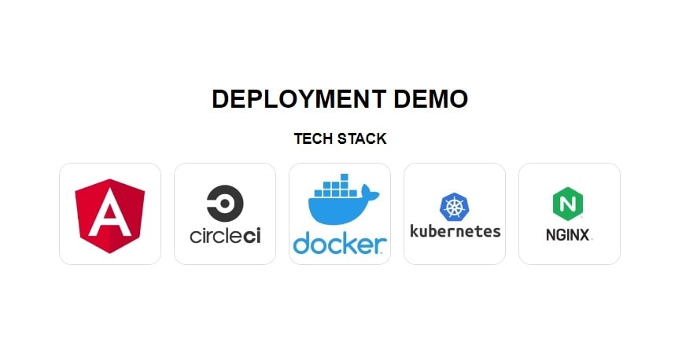

# Deployment Demo

> ### Sample application to demo deployment concepts

 

 

This app demonstrates continuous integration, containerization and orchestration.

### Utilizes:

<ul>
  <li>Angular</li>
  <li>CircleCI</li>
  <li>Docker</li>
  <li>Kubernetes</li>
  <li>Nginx</li>
</ul>

Also used Docker Desktop with Kubernetes and have made the docker repo publicly available:

<a href="https://hub.docker.com/r/ianacodev/deployment-demo" target=_blank>ianacodev/deployment-demo</a>

## Deploying Angular application on Kubernetes

### Step 1:

- Create angular application.

### Step 2:

- Create Dockerfile with multi-stage build for application build and nginx server.

### Step 3:

- Create circleci config to build and push docker image to dockerhub.

### Step 4:

- Create K8s deployment and service manifest.
