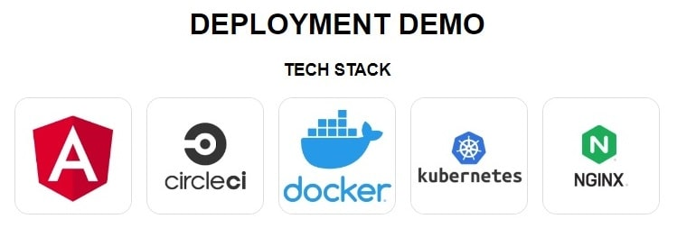

# DeploymentDemo

> ### Sample application to demo deployment concepts

  

This app demonstrates continuous integration, containerization and orchestration.

### Includes

<ul>
  <li>Angular</li>
  <li>CircleCI</li>
  <li>Docker</li>
  <li>Kubernetes</li>
  <li>Nginx</li>
</ul>
 

# Deploying Angular application on Kubernetes

## Step 1:

### Create angular application.

 

## Step 2:

### Create Dockerfile with multi-stage build for application build and nginx server.

 

## Step 3:

### Create circleci config to build and push docker image to dockerhub.

 

## Step 4:

### Create K8s deployment and service manifest.
